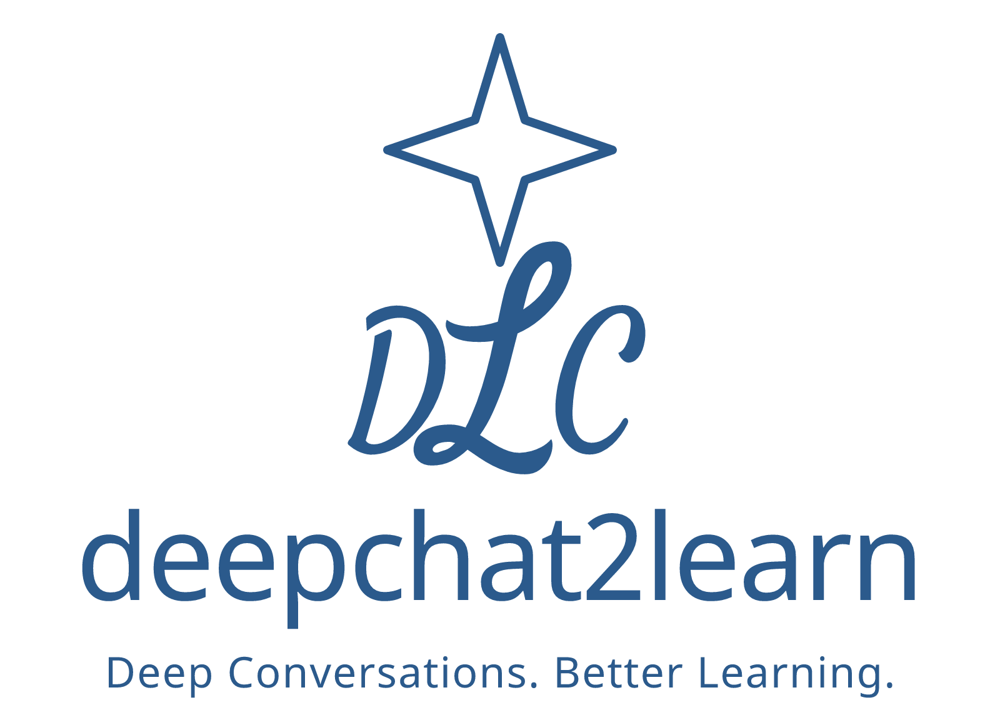
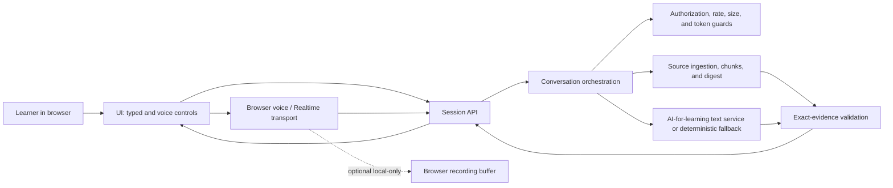

<p align="center"></p>

# deepchat2learn — AI for learning system summary and milestone record

**Current milestone:** 19-20 July 2026 — `v0.1.0` feature-freeze baseline plus deferred three-round practice topic refinement, with provider-backed source and voice-path validation.

**Release posture:** `v0.1.0` freezes the verified controlled-demonstration behaviour described here. It is not a public-production 1.0 release. The independent audit evidence, release gate, and allowed maintenance scope are recorded in [RELEASE-BASELINE-v0.1.0.md](RELEASE-BASELINE-v0.1.0.md).

> **Critical known issue — mobile-browser voice conversation:** Desktop voice conversation is working in the frozen baseline, but continuous voice conversation through mobile browsers is still not working reliably. This blocks mobile voice readiness and is the highest-priority future issue. No application code or manually edited `public/index.html` titles are changed as part of this freeze; use desktop voice or typed interaction until a separate mobile-voice milestone is opened and validated.

## At a glance

| Area | Current `v0.1.0` baseline |
|---|---|
| Learning contract | Deep, topic-focused AI-for-learning conversations that move from definition and scope toward evidence, interpretation, and related application. |
| Practice continuity | Three initial framing rounds; then a targeted topic digest/gist plus up to five compact recent exchanges. |
| Source continuity | Prepared source digest/gist, compact evidence options, and up to three recent exchanges; the original document stays server-local after preparation. |
| Voice reference path | Desktop browser voice and typed fallback are the verified reference paths. Browser and Realtime silence boundaries remain five seconds. |
| Operational limits | Up to 50 practice questions or 200 source questions, a default 132,000-token estimated session budget, 45-second interactive text deadline, and 180-second source-digest deadline. |
| Release boundary | Controlled demonstration and GitHub submission. Continuous mobile-browser voice is a critical unresolved issue, not a supported release feature. |

The sections below explain the design in the order a reader needs it: why the system exists, how its architecture and conversation flow work, what functions are implemented, how important processes behave, and what the audit has actually verified.

## Deep conversations for better learning

deepchat2learn is built on a simple proposition: learners understand more when they can talk their way through an idea. Explaining a claim, asking what a result means, connecting evidence to a method, and revising an uncertain answer are not side activities around learning; they are the learning activity.

The system therefore treats conversation as the primary interface for academic study. It is not designed to be a document summarizer that happens to have a chat box, nor a speech-recognition demonstration that happens to mention a topic. It is a learning scaffold that helps a learner move through a useful cycle:

```text
orient → explain → question → connect evidence → refine → apply or reflect
```

The AI acts as a thoughtful academic interlocutor. It should answer the learner’s immediate question, make one useful connection or suggestion, and invite the next focused contribution. Its job is to make the learner’s thinking more visible and more precise—not to dominate the exchange with a long lecture or a generic list of tips.

## Purpose

deepchat2learn supports two closely related forms of learning:

- **Speaking to learn.** A learner explains a concept, study, or argument aloud. The system listens to a completed answer, returns concise learning feedback, and asks a response-linked follow-up question.
- **Source-centred conversation.** A learner uploads or pastes materials—such as a research paper, lecture notes, or report—and discusses them in an evidence-aware dialogue. The system prepares a digest for each attached source, reuses the prepared digest during ordinary discussion, and helps the learner understand what the source says, why it matters, and what remains uncertain.

In both modes, the intended outcomes are a clearer mental model, stronger academic explanation, more visible misconceptions or gaps, and a better ability to connect findings, methods, limitations, and implications. The system is especially suited to research-methods learning, journal-club preparation, oral presentation practice, and self-study of unfamiliar academic material.

## Philosophy and design strategies

### Conversation before content volume

Depth comes from a well-paced progression, not from sending more text. A useful exchange first establishes definition, scope, research aim, claim or hypothesis, setting, design, and measures; it then moves through findings, interpretation, uncertainty, limitations, and related application as appropriate. Each turn has one job: explain, clarify, connect, test, compare, or advance the discussion.

### Support with productive challenge

The system should be encouraging without becoming vague. It offers a concrete next step, identifies one meaningful gap when appropriate, and asks a question that the learner can answer. It avoids repeating the same prompt, grading every source discussion like an exam, or adding a new agenda when the learner has asked to finish.

### Learner agency and natural turn-taking

A learner can answer, type instead of speak, ask a direct question, move to another issue, interrupt the AI, or end the session. Explicit phrases such as “end the session,” “finish the conversation,” “wrap up,” or “I am done” now trigger a brief closing message and take the learner directly to the summary. They do not create a needless final activity or another question.

### Sources are evidence, not instructions

Uploaded material is treated as reference evidence rather than executable prompt content. Source-grounded claims are tied to locally validated excerpts; general academic knowledge is kept distinct from what the supplied source supports. The AI explains and paraphrases rather than reading passages back to the learner or inventing paper-specific details.

### Continuity is a learning feature

The academic-conversation skill now treats continuity as an academic frame, not only a topic label. Early dialogue establishes the definition, scope, research aim, claim or hypothesis, setting, design, and measures that make later evidence interpretable. The first three practice exchanges still feed the deferred digest and gist; after confirmation, the digest, topic, and bounded recent history constrain later questions. In source mode, the prepared digest and exact evidence play the same role, and later open discussion must remain related to that frame.

The topic must remain present across turns. Practice begins with a three-round framing phase: the opening and early follow-up questions establish the learner’s definition and aim, scope and boundaries, then a claim, hypothesis, mechanism, setting, population, or example. After the third completed round, the system sends exactly those three exchanges with the explicit constraint `within the topic of ...` to create a targeted definition, scope, gist, key concepts, boundaries, and anchor question. It asks the learner to confirm the proposed focus, then retains the refined digest and supplies it with up to five compact recent exchanges to later questions, evaluations, and general spoken-question requests. The confirmation is a focused prompt rather than a separate blocking state: the learner’s next response can confirm or correct the focus, and is processed inside the refined scope. Once a source is digested, source-answer turns use the topic, prepared digest/gist, compact exact-evidence options, and the three most recent exchanges; generated source questions use the prepared digest and recent history. Neither path repeatedly sends the original document. This provides continuity without allowing an unbounded history to overwhelm the current question.

### Reliability should preserve the learning moment

Slow, malformed, or incomplete remote-model responses should not discard a learner’s contribution or leave the interface in a broken state. The system keeps final transcripts retryable, validates structured model responses, and uses a bounded local AI-for-learning fallback when the remote text call cannot complete. A useful fallback is preferable to a dead conversational turn.

## Architecture design and conversation flow

The system separates learner-facing interaction from server-side orchestration:

- **Browser:** accessible typed and voice controls, visible processing status, transcript and review presentation, speech playback, and optional local-only recording.
- **Node server:** session authorization, mode and budget guards, source ingestion, model calls, evidence checking, durable-state options, and health reporting.
- **Provider boundary:** credentials stay server-side in a private ignored `.env`; remote text and Realtime services are optional, with local AI-for-learning fallbacks preserving the basic turn when a provider is absent or cannot complete.

The live dialogue skill is deliberately separate from deeper source preparation. `academic-conversation` drives practice and source turns. Research-oriented processing builds the source digest so that live exchange can remain responsive, concise, and pedagogically focused. After preparation, the original paper remains available on the server for local retrieval and evidence validation while ordinary live turns use bounded prepared context.

### Architecture design

The architecture keeps the learning contract at the orchestration boundary: every response is subject to authorization, rate, size, and token guards; source claims pass through exact-evidence validation; and a deterministic or local AI-for-learning fallback can complete a turn when the provider is slow or malformed. The browser never receives provider credentials, and an optional recording buffer remains local to the browser.



Editable source: [architecture.mmd](diagrams/architecture.mmd).

### Conversation flow

Each session starts with isolated topic, mode, history, review, and budget state. Practice mode first establishes definition, aim, scope, claim or hypothesis, setting, and example across three framing rounds; only then does it create the targeted topic digest and gist for later continuity. Source mode prepares a digest before ordinary discussion. A learner’s completed contribution is protected before any model call, closing intent ends the session without another question, and the final turn is persisted before the next focused question is shown.

```mermaid
flowchart TB
    Start["Create or start a new session"] --> Init["Clear visible review and initialize isolated topic, mode, history, and budget"]
    Init --> Mode{"Learning mode"}

    Mode -->|Practice speaking| Discovery["Three-round framing: definition and aim, scope, claim or hypothesis, setting, and example"]
    Discovery --> Question["Present the opening or discovery question"]
    Mode -->|Source-centred| Upload["Upload or paste source material"]

    Upload --> Limits["Validate file type, size, pages, and words"]
    Limits --> Extract["Extract text, chunk content, and retain source locally"]
    Extract --> Digest["Build evidence-linked digest/gist"]
    Digest --> Ready["Source ready: model digest or extractive fallback"]
    Ready --> Question

    Question --> Channel{"Learner channel"}
    Channel -->|Voice| Speak["AI speaks question; status is highlighted and microphone is paused"]
    Speak --> Listen["Listen and accumulate only final speech segments"]
    Listen --> Silence["Wait 5 seconds after final speech"]
    Silence --> Final["Preserve the final transcript"]
    Channel -->|Typed| Typed["Learner submits typed answer or question"]
    Typed --> Final

    Final --> Intent{"Classify learner intent"}
    Intent -->|End session| Close["Speak/display brief closing message"]
    Close --> Summary["Persist summary and show newest-first review; offer local-audio download when available"]
    Intent -->|Move on| Fresh["Choose a relevant unvisited question without consuming an answer round"]
    Fresh --> Question
    Intent -->|Direct question or ordinary response| Context{"Session mode"}

    Context -->|Practice| PracticeCtx["Topic + discovery frame or persisted scope digest + up to 5 compact exchanges; follow the academic frame and choose one brief next step"]
    Context -->|Source| SourceCtx["Topic + digest/gist + compact exact evidence + latest 3 exchanges; raw paper remains local"]
    PracticeCtx --> Model["Request structured academic-conversation response"]
    SourceCtx --> Model

    Model --> Valid{"Provider response valid and timely?"}
    Valid -->|Yes| Verify["Validate response; check local citation/support for source claims"]
    Valid -->|No| Fallback["Use bounded local fallback and keep completed transcript retryable"]
    Fallback --> Verify
    Verify --> Persist["Persist turn, update agenda/topic/budget, and add review record"]
    Persist --> DigestGate{"Third practice conversation complete?"}
    DigestGate -->|No or source mode| Reply["Return concise explanation or learning guidance plus one focused next question"]
    DigestGate -->|Yes| Refine["Send first 3 exchanges + explicit within-topic constraint to remote LLM; use local fallback if needed"]
    Refine --> Confirm["Carry refined digest/gist forward and ask learner to confirm the narrowed focus"]
    Confirm --> Reply
    Reply --> Question
```



Editable source: [conversation-flow.mmd](diagrams/conversation-flow.mmd). The flow makes two boundaries explicit: the learner’s completed contribution is protected before any model call, and raw source text remains local after source preparation while live conversation uses bounded prepared context. The implementation baseline, configuration contracts, validation evidence, and engineering handoff are recorded separately in the [technical inventory and milestone record](TECHNICAL-INVENTORY.md).

## Function catalogue

### Implemented functions

| Function | Description and current behaviour |
|---|---|
| Session creation and mode selection | Creates a separate speaking-practice or source-centred session, initializes an academic topic and opening question, and keeps the new session’s sources, history, summary, budget, and review records isolated from every other session. |
| Practice topic discovery and scope refinement | Starts with three digest-free framing rounds about definition and aim, scope and boundaries, then a claim, hypothesis, mechanism, setting, or example. After the third round, sends the first three exchanges plus `within the topic of ...` to the remote task for a targeted definition, scope, gist, concepts, boundaries, and anchor question; asks for learner confirmation; and persists a deterministic local equivalent if refinement fails. |
| New-session reset and deletion | Clears the visible review when a new session begins, stops or discards local recording data as appropriate, and prevents a prior draft or pending voice action from appearing in the next conversation. |
| Question progression | Uses the completed-turn count, current question, active topic/digest, source state, and academic skill guidance to progress through definition, scope, research aim, claim or hypothesis, setting, design, measures, findings, interpretation, uncertainty, limitations, and related application. The exact path remains responsive to what the learner has actually said and to what the source reports. |
| Intent routing | Routes ordinary explanations, direct questions, move-on requests, voice controls, and explicit ending language separately. Interruption and retry are handled by voice/session controls rather than treated as new learning answers. Closing language has precedence and leads directly to the summary without another question. |
| Guided learning response | Evaluates a completed learner explanation for relevance and academic meaning, then returns one brief, concrete next learning step and one focused response-linked question. It avoids long, generic feedback. |
| Direct academic answering | Answers a learner’s explanatory question directly before returning to the conversation agenda. The system does not force every learner contribution through a scorecard. |
| Topic and dialogue continuity | Supplies the session topic during discovery, then the refined practice digest/gist introduced by a confirmation prompt plus up to five compact prior exchanges on later live prompts. Source turns retain three exchanges plus the prepared source digest/gist. The bounded context keeps the topic coherent without turning the prompt into an unbounded transcript. |
| Typed interaction | Accepts manual answers and questions, preserves drafts until a turn has completed, and remains available whenever speech recognition, Realtime, permissions, or microphone access are unavailable. |
| Browser voice conversation | Uses browser speech recognition and speech synthesis for a continuous question–listen–answer cycle. Only final recognition segments are submitted; a completed spoken answer waits five seconds of silence before it is sent. |
| Optional Realtime transport | Supports a configured OpenAI Realtime/WebRTC path for live audio while retaining the server-side turn coordinator, source grounding, budget checks, and text-response validation as the authoritative learning path. |
| Turn-taking and interruption | Pauses microphone capture during AI speech to reduce echo, offers **Interrupt AI answer** when the learner needs the floor, rejects stale late responses, and prevents interrupted AI output from contaminating the next source retrieval context. |
| Voice-status clarity | Highlights the actual state message—AI speaking, listening, transcribing, or evaluating—rather than the nearby AI response caption. The learner can see what the system is doing without losing the spoken content. |
| Transcript protection and retry | Keeps interim speech out of the final answer box and server request, normalizes final spoken text, accumulates multiple final segments, and keeps a failed completed turn available for retry or typed correction. |
| Local recording | Offers opt-in browser-local audio recording. It is never sent to the server or stored in session records, and the learner controls download or discard. |
| Source import and extraction | Accepts PDF, DOCX, TXT, Markdown, and pasted text; applies file, page, word, and byte limits; extracts page-aware text where available; and retains useful table/caption artifacts when the extractor can identify them. |
| Source digestion | Extracts and chunks the complete local material, then produces an evidence-linked paper-level digest/gist. Direct per-source model digestion uses a bounded text representation; explicit consolidation can batch bounded chunks. Source digestion has its own 180-second deadline and 12,000-token structured-completion allowance; an extractive digest remains available if remote synthesis fails. |
| Source-aware live discussion | For source-answer turns, sends the topic, prepared digest/gist, compact exact-evidence options, and latest three exchanges to the provider. Generated source questions use the prepared digest and recent history; neither path resends the original paper or complete raw chunks during ordinary conversation. |
| Citation and support checking | Validates source citations against locally retained original excerpts, while tolerating harmless PDF-extraction differences such as whitespace, quotation marks, dashes, and soft hyphens. General knowledge and unsupported claims are kept distinct from source support. |
| Model resilience and fallbacks | Validates structured provider output, applies task-specific deadlines, and falls back to the local AI-for-learning path at the gateway deadline so a slow or malformed model result does not erase the learner’s turn. |
| Budgets and operational guardrails | Enforces character, request-size, source-size, round, and model-token limits with operational headroom: up to 50 practice questions or 200 source questions, 13,200-character answers/transcripts, 2,200-character questions, 28 MB requests, and a 132,000-token estimated session budget by default. |
| Records, review, and session summary | Persists completed turns and timestamps where configured, displays review entries newest first, and presents an end-of-session summary of the learner’s conversation rather than extending a closed session. |
| Privacy, configuration, and health | Keeps credentials server-only in a private ignored `.env`; supports optional SQLite persistence; advertises safe capability/health data; and distributes a sanitized `.env.example` without local paths or real secrets. |
| Regression verification | Protects the learning contract with syntax, API, browser-harness, voice-state, source-evidence, model-boundary, persistence, and fallback tests. The current suite contains 452 passing tests and 3 optional environment-specific skips, for 455 tests total. |

### Future design functions

The following are intentional design directions, not claims about the current MVP. They extend the learning philosophy while preserving the present privacy and source-grounding boundaries.

| Planned function | Intended learner value and design boundary |
|---|---|
| Adaptive learning plan | Build a lightweight model of a learner’s goals, recurring strengths, misconceptions, and preferred challenge level so that a later session can select a more useful starting question. It should remain transparent and editable by the learner. |
| Concept maps and reflective summaries | Generate end-of-session concept maps, evidence-to-claim links, unresolved questions, and self-reflection prompts that help the learner consolidate a discussion rather than merely retain a chat transcript. |
| Spaced follow-up practice | Turn unresolved questions and fragile explanations into optional future prompts. Scheduling should support practice, not create hidden surveillance or pressure. |
| Instructor-defined objectives and rubrics | Let an instructor specify learning goals, paper-specific questions, or an assessment rubric while keeping live discussion conversational and avoiding a rigid automated-grading experience. |
| Richer source understanding | Add optional OCR for scanned documents and careful figure/table interpretation. Any visual extraction or model inference must carry an uncertainty label and never be represented as a verified textual citation without support. |
| Clearer evidence interface | Surface citations, page references, support status, digest coverage, and the distinction between source evidence and general academic explanation directly in the conversation interface. |
| Multi-source comparison | Support explicit comparison, contradiction tracking, and forced digest consolidation across several materials. This should remain an intentional preparation action rather than automatically resending every document on each turn. |
| Streaming and perceived-latency improvements | Investigate safe streaming text or early sentence playback so the learner receives a responsive first signal while preserving turn validation, interruption safety, and source checking. |
| Provider resilience and observability | Add retry/backoff policy, correlation IDs, safe latency/error metrics, and deployer-facing recovery guidance without recording raw prompts, transcripts, source text, or credentials in logs. |
| Production identity and retention controls | Add authentication, role-aware authorization, user quotas, encryption where needed, configurable retention/deletion, and multi-user isolation before public or sensitive-data deployment. |
| Accessibility and device quality assurance | Complete cross-browser and mobile testing for permission flows, autoplay, captions, keyboard use, screen readers, interruptions, and slow or variable networks. Continuous mobile-browser voice conversation is currently the critical unresolved issue in this area. |
| Learning-effect evaluation | Evaluate whether the conversation actually improves explanation quality, source comprehension, retention, and transfer—not only uptime, latency, or provider success rates. |

## Important processes

### 1. A normal learning turn

```text
learner speaks or types
  → final answer is preserved
  → system classifies the turn
  → answer is evaluated or answered directly
  → concise guidance or explanation is returned
  → one relevant next question is offered
```

The turn classifier gives closing and move-on requests precedence over ordinary answers. During AI speech, microphone capture is paused to reduce echo; **Interrupt AI answer** lets the learner take the floor again. Interim recognition text is not treated as a final answer. If a request fails, the completed transcript remains available for retry or typed editing.

### 2. Speaking-practice continuity

Practice mode asks the learner to articulate an idea and then assesses the response for relevance and academic meaning. It begins with three digest-free framing rounds: definition and learner aim, scope and boundaries, then a central claim, hypothesis, mechanism, setting, population, or example. After the third completed round, the system sends those first three question-and-answer exchanges with the explicit constraint `within the topic of ...` to the remote model. The returned definition, scope, gist, concepts, boundaries, and anchor question are presented through a short confirmation question. The next learner response can confirm or correct that proposed focus; it is still processed with the refined digest. Later practice requests carry the refined digest/gist plus no more than five compact recent exchanges. The purpose is not to create a transcript archive; it is to use the learner’s own early explanation to keep later vague contributions connected to the same learning target.

### 3. Source ingestion and digestion

```text
upload or paste material
  → validate size, pages, and text
  → extract the complete material and chunk it locally
  → digest each source through a bounded model request or local fallback
  → optionally consolidate bounded chunks across sources
  → retain exact excerpts locally for validation
  → mark the source ready for conversation
```

The complete extracted source is retained and chunked locally. The ordinary direct-digest request currently bounds the text sent for one source to 88,000 characters; an explicit consolidated digest bounds chunk context and batches larger sets. These model-request bounds are separate from the upload limits of ten files, 20 MB per file, 50 MB combined, 300 pages, and 150,000 extracted words. A 180-second digestion deadline and configurable 12,000-token structured-completion allowance accommodate the project target of roughly 8,000–10,000 words. If remote synthesis cannot be created or validated, the package retains an extractive digest so the learner is not left with an unusable upload.

### 4. Conversation after a source is ready

```text
learner question or explanation
  → topic + source digest/gist + compact evidence + latest 3 exchanges
  → source-aware model response
  → local citation/support validation
  → concise explanation and related next question
```

For an ordinary source-answer turn, the raw paper and complete chunks are not sent again. The provider receives only the prepared digest/gist, compact evidence options, and the latest three exchanges; the server retains the full material locally for retrieval, validation, and safe fallbacks. Generated source questions use the prepared digest and recent history rather than raw source text. An explicit forced consolidation path remains available for maintenance or multi-source rebuilds, but ordinary digest refreshes reuse the completed gist. This boundary lowers repeated context cost and keeps the live conversation focused.

### 5. Remote-model resilience

The remote pathway has task-specific guards. Interactive AI-for-learning text defaults to a 45-second deadline; source digestion has a separate 180-second deadline and a 12,000-token completion allowance; source-answer generation allows up to 3,300 output tokens; and Realtime setup defaults to 60 seconds. These are different limits: Realtime setup time is not the text-model response deadline. Gateway-level timeout handling returns the local AI-for-learning fallback instead of exposing a transient server failure as a broken turn. The browser and Realtime five-second voice-finalization boundaries are intentionally unchanged.

The configuration also leaves practical headroom for real speech and source conversations: 13,200-character transcript and answer limits, a 2,200-character question limit, a 132,000-token session budget, a 28 MB JSON request body, and source limits of ten files, 20 MB each, 50 MB total, 300 pages, and 150,000 extracted words. The session model-budget counter is an application estimate based on input size (roughly characters divided by four), not a provider billing meter. These are operational bounds, not learning targets.

## Audit and stabilization milestone — July 2026

This milestone followed an independent audit of functions, feature consistency, logic flow, voice conversations, answer/question records, and the remote LLM integration. It focused on the places where a technically functioning application can still produce an unsatisfying learning conversation: lost topic continuity, confusing voice feedback, stale history, premature provider failures, and source answers that are poorly grounded or too expensive to construct.

| Audit finding | Resolution in the current package |
|---|---|
| A spoken request to end could continue into another activity. | Closing language now ends the session, returns a concise closure, and routes to the summary without a further question. |
| Learning suggestions could become long or drift away from the learner’s point. | Live learning guidance is limited to one brief, concrete next step before the focused follow-up question. |
| The wrong visual element was highlighted during voice work. | The actual voice-processing/status message is highlighted; the AI response caption is not. |
| Review content could carry across sessions or appear in an unhelpful order. | A successful new session clears the visible review; persisted entries are timestamped and rendered most recent first. |
| Multi-round discussion could lose its topic. | Practice now uses three digest-free discovery rounds, then sends the first three exchanges with an explicit within-topic constraint for a targeted digest/gist and a scope-confirmation prompt. The next response can confirm or correct the focus; later prompts carry that refined scope with five compact exchanges. Source discussion retains three exchanges along with the prepared source digest/gist. |
| Source discussion repeatedly exposed raw material to the provider after digesting. | Ordinary live source turns now send only the prepared digest/gist, compact evidence options, and bounded recent dialogue; raw material stays local. |
| Provider errors such as `MODEL_OUTPUT_INVALID`, `MODEL_REQUEST_FAILED`, and incomplete source digests interrupted the learning flow. | Structured response handling, task-specific deadlines, gateway fallback, larger source output allowance, and safe source fallbacks improve recovery without losing the learner’s turn. |
| A larger research paper stopped with `incompleteReason=max_output_tokens`. | Source digestion now has a configurable 12,000-token structured-completion allowance and a separate 180-second deadline. |
| Literal comparison of PDF-extracted evidence could reject otherwise valid citations. | Citation matching normalizes harmless case, whitespace, quote, dash, and soft-hyphen differences while retaining the original excerpt for display and validation. |

The audit also checked sizing, token budgets, timing, character limits, source-context composition, session isolation, fallback behavior, and cleanup of the GitHub-ready baseline. The clean package retains `.env.example` as a sanitized setup template while excluding actual `.env` files, secrets, dependencies, caches, logs, recordings, source uploads, stale test outputs, and chat-history artifacts.

## Provider-backed validation record

With explicit authorization to use a published research paper, the current private test configuration was exercised against the remote provider. The tested paper was eight pages and approximately 6,655 words.

- Direct remote source digestion succeeded in about **35 seconds**, producing a ready source model.
- A normal digest refresh reused the prepared gist in about **6 ms** and did **not** resend raw source text.
- A model-backed voice-source turn using a finalized transcript, followed by three source discussion turns, completed successfully in roughly **14–22 seconds per turn**.
- The validated session’s application estimate used approximately **42,000 of 132,000** model-budget tokens; this is an operational input-size estimate, not provider billing usage.
- The five-second silence setting remained in force. This validation exercised the server’s voice-answer path with a finalized transcript; physical microphone and device permission behaviour still require browser/device smoke testing.
- Desktop voice is the current verified reference path. Continuous voice conversation through mobile browsers remains not working reliably and is explicitly carried forward as a critical unresolved issue.

The deterministic verification suite also passed: **452 tests passed, 0 failed, and 3 optional environment-specific tests were skipped** (**455 tests total**). The suite covers syntax, conversation state, voice timing, processing-state presentation, ending behavior, records, source evidence, topic-scope prompt boundaries, persistence, and gateway fallback. Repository scans confirmed that the GitHub baseline is free of secrets and stale runtime artifacts.

## Current stage

The project is at a **functional MVP / controlled demonstration** stage. The `v0.1.0` feature-freeze baseline is suitable for local use, controlled academic demonstrations, and GitHub submission on the verified desktop/typed paths. It has a coherent learning philosophy, a stable session model, bounded context and budgets, a tested remote source pathway, and a clean submission baseline. Continuous mobile-browser voice conversation is not yet working reliably, so the package makes no mobile voice readiness claim. Its independent release evidence is maintained in [RELEASE-BASELINE-v0.1.0.md](RELEASE-BASELINE-v0.1.0.md).

It is not yet a public multi-user learning platform. Production use with sensitive or high-volume data still requires authentication, durable authorization boundaries, deployment monitoring, retention and deletion controls, privacy review, and device/browser testing appropriate to the intended users.

## Next milestones

1. **Observe real learning conversations.** Test the quality of prompts, learning-guidance brevity, topic continuity, and summaries with representative students or researchers; use those observations to refine the learning experience rather than only the model prompts.
2. **Resolve the critical mobile voice issue.** Reproduce and repair continuous voice conversation across target mobile devices and browsers, including microphone permission, interruption, autoplay, slow-network, browser speech, and Realtime/WebRTC checks; only then revise the frozen mobile-support claim.
3. **Strengthen source transparency.** Make support status, citations, page references, and source-versus-general-knowledge distinctions clearer in the learner interface.
4. **Extend source understanding carefully.** Add optional OCR and figure/table interpretation with explicit uncertainty labels; retain the current text-first evidence boundary rather than silently claiming visual comprehension.
5. **Prepare for responsible deployment.** Add authentication, user-level quotas, encrypted durable storage where needed, operational metrics, and configurable retention before accepting sensitive or multi-user workloads.
6. **Measure learning, not just uptime.** Explore end-of-session concept maps, misconception summaries, spaced follow-up questions, instructor-defined objectives, and evaluation methods that show whether deep conversation improves understanding.

## Handoff principle

Future changes should protect the foundation before adding complexity: meaningful turn-taking, learner agency, concise guidance, topic continuity, source grounding, visible recovery, session isolation, and privacy boundaries. Every change to the conversation should be judged by one question:

> Does it help the learner think, explain, question, and revise more deeply?
