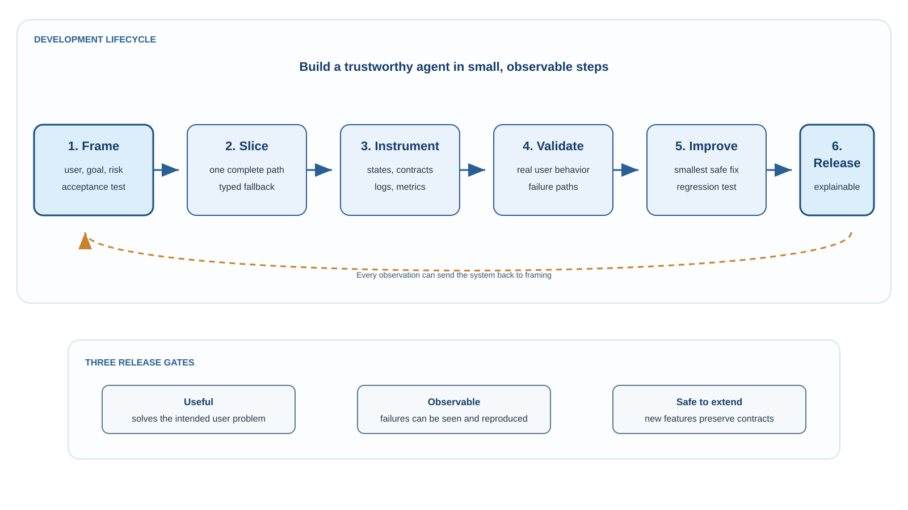
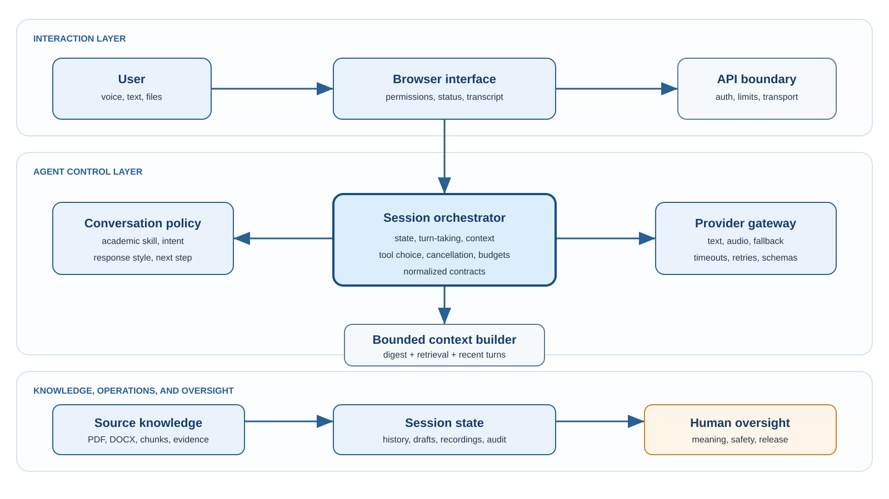
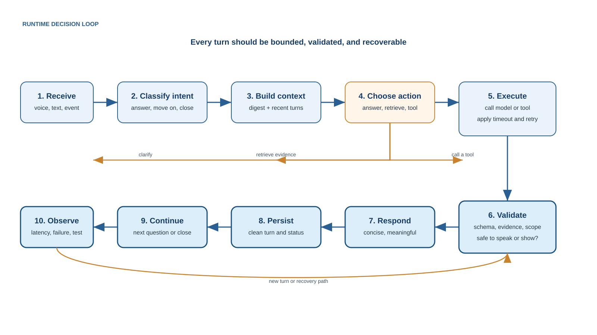
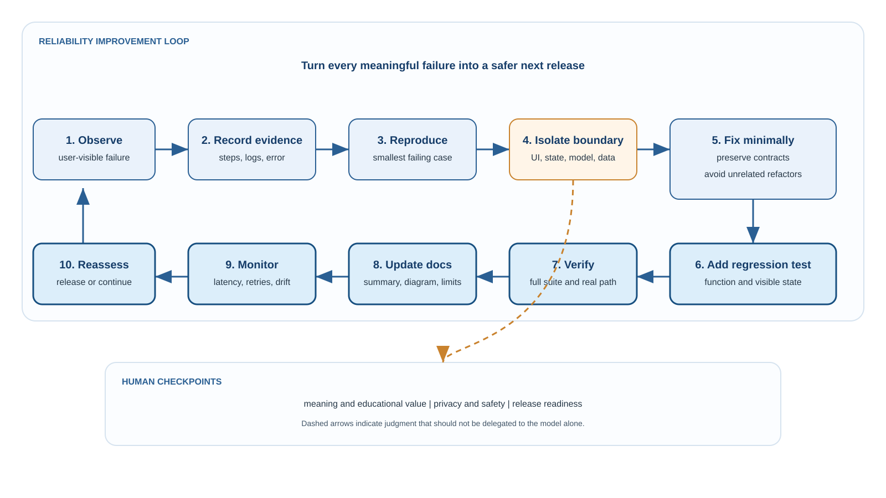

# Developing a Deliverable AI Agentic Tool

## An integrated development summary

This document combines the development lessons, recurring failure patterns, visual models, and professional review recommendations from the deepchat2learn project. It is intended for developers, product owners, domain experts, and students learning how to build dependable AI applications.

The central principle is:

> A trustworthy AI tool is a system of states, context, model calls, user experience, tests, and safeguards - not simply a prompt connected to an API.

## Executive summary

The most reliable development strategy is to build one complete user journey first, make its state and function contracts explicit, test it in realistic conditions, and add capability only when the existing path remains observable and safe.

For a voice-first academic agent, this means:

1. Keep the conversation loop fast and predictable.
2. Keep source digestion and deep analysis separate from live turn-taking.
3. Give each session and mode its own context.
4. Use the right model and skill for each task.
5. Turn every important failure into a regression test.
6. Keep humans responsible for meaning, safety, and release decisions.

## How to use this document

- Use **The ten lessons** when planning or extending the system.
- Use **The five recurring issues** when diagnosing failures.
- Use **Acceptance evidence** before declaring a feature ready.
- Use **The implementation priorities** to decide what to fix first.
- Use **The final checklist** before distribution.

## Visual model of the system

### 1. Development lifecycle

The lifecycle is deliberately iterative: frame a user problem, build a narrow slice, instrument it, validate it, improve it, and release only when the evidence is sufficient. Observation should be able to return the project to the framing stage.

### 2. Agentic architecture

The session orchestrator is the control center. It coordinates the interface, conversation policy, bounded context, providers, source knowledge, session state, and human oversight. No single model call should own the entire application.

### 3. Runtime decision loop

Each turn receives bounded context, chooses an explicit action, validates the result, returns a normalized response, and persists a clean state. Possible actions include answering, retrieving evidence, calling a tool, asking for clarification, or escalating.

### 4. Reliability improvement loop

An observed failure becomes useful only when it is documented, reproduced, isolated, fixed, tested, monitored, and reviewed by a human where meaning or safety is involved.

## The ten lessons

### 1. Start with the user problem and one complete journey

Define the user, the problem, the risk of being wrong, and the acceptance test. Then build one complete path: start a session, ask a question, receive a typed or spoken answer, return a relevant response, ask a follow-up, and save the exchange.

Keep a typed fallback working before adding voice, source digestion, recording, multiple providers, or analytics. Every later feature should preserve the same core journey.

### 2. Put an explicit session orchestrator at the center

The orchestrator should own the session ID, mode, turn, current speaker, cancellation token, source context, bounded history, provider request, and normalized response. The browser manages interaction and permissions; the server manages secrets, providers, document processing, and persistence.

Use explicit states such as `idle`, `ai-speaking`, `user-listening`, `user-speaking`, `finalizing`, `processing`, `ready`, `stopped`, and `error`. Every transition needs one owner, a visible status, a cancellation path, and a test.

### 3. Treat voice as a turn-taking protocol

While the AI speaks, microphone capture must be paused or ignored. If the user interrupts, stop playback, cancel the unfinished AI turn, discard stale interim text, and start a fresh user turn.

Interim recognition is display-only. Only one finalized transcript may enter the answer box, history, or model request. Clean fillers and stutters for comprehension, but preserve the original recording separately when local recording is enabled.

### 4. Separate fast conversation from deep source work

Source processing may extract text, tables, figures, metadata, chunks, citations, and a paper-level digest. Live conversation should receive only the digest, targeted evidence, the current question, the current answer, and one to three recent exchanges.

Do not resend the entire paper or full session on every turn. The response should explain the source in original language, distinguish evidence from inference, and use general LLM knowledge for definitions or methods that the source does not explain.

### 5. Use skills as small operating policies

The live academic conversation skill should be short and optimized for latency. It should be constructive, empathetic, concise, and progressive: begin with simple questions, move toward methods and implications, answer direct questions, connect follow-ups to the learner's response, avoid circular questioning, and change topic when requested.

Use specialized research skills for source digestion or formal appraisal. After digestion, use the compact conversation skill over the digest and retrieved evidence. This division keeps the voice loop fast while preserving methodological depth.

### 6. Make function contracts and instructions executable

For every important function, record its inputs, outputs, state changes, provider dependency, timeout, fallback, error behavior, and tests. For every requested change, state the goal, evidence, constraints, expected behavior, and acceptance test.

Review this flow after each change:

`user action -> UI state -> orchestrator state -> provider request -> normalized response -> UI update -> stored session state`

Check for missing returns, stale closures, duplicate listeners, uncancelled requests, inconsistent field names, and UI updates that do not update session state.

### 7. Keep context bounded and session-specific

Use session-scoped identifiers and separate practice and source histories. Clear drafts after completion or interruption. Limit live context to what the current turn needs. A new session or page refresh should not inherit prior source material, answers, or mode-specific history.

### 8. Keep humans responsible for meaning and release

People should define usefulness, check academic accuracy, review source-grounded claims, judge uncertainty, test real browser and microphone conditions, approve fallbacks, and make privacy, safety, and release decisions.

AI can accelerate coding, test generation, refactoring, and design comparison. It should not be the sole judge of educational value, safety, or correctness.

### 9. Match models and costs to task risk

Use the least expensive model that meets the acceptance test. A fast model can handle routing, transcript cleanup, turn-level conversation, and formatting. A low-latency audio model can handle live speech. A stronger text model can handle source digestion, difficult explanations, and high-stakes synthesis.

Record model, prompt version, latency, token estimate, fallback, and user-visible outcome for important requests. Escalate only when a defined quality or uncertainty test requires it.

### 10. Test the real system and maintain a living release record

Test long and short speech, hesitation, noise, interruption, microphone denial, slow providers, timeouts, malformed transcripts, large PDFs, tables, figures, outside-knowledge questions, session refresh, mode switching, recording, missing keys, and invalid keys.

Every important bug should become a regression test. At each milestone, reconcile the code, function tally, state diagram, documentation, configuration, test results, security status, known limitations, and package contents.

## Five recurring issues and their controls

These issues are intentionally separate from the ten lessons. The lessons describe what to build; this section describes what commonly goes wrong and what evidence should prove the fix.

| Issue | Typical failure | Primary control | Acceptance evidence |
|---|---|---|---|
| **1. Voice timing and transcript integrity** | Clipped speech, AI echo, short recordings, duplicate transcripts, or cancelled text leaking into the next turn | Explicit voice states, microphone suppression during AI speech, cancellation tokens, one finalized transcript per turn | Repeated interruption and long-speech tests produce one clean user transcript and no AI echo |
| **2. Shallow or repetitive source understanding** | The model rereads the paper, ignores the user's question, or asks circular follow-ups | Paper digest, targeted retrieval, table/figure facts, current exchange, original-language synthesis, topic agenda | Different source questions yield distinct, evidence-linked answers that add explanation rather than quotation |
| **3. Context and session leakage** | Old answers or source history appear in a new turn, mode, or session | Session-scoped state, separate mode histories, bounded context builders, draft clearing | Refresh, new-session, mode-switch, duplicate-request, and interruption tests show no cross-session leakage |
| **4. Latency, limits, and fallback ambiguity** | `MODEL_REQUEST_FAILED`, long waits, repeated processing messages, or unexplained fallback | Fast/strong model paths, request budgets, provider-aware timeout, cancellation, one safe retry, structured errors | Latency and failure-stage metrics are visible; the user gets a useful retry or fallback without a stuck state |
| **5. Incomplete verification and oversight** | Unit tests pass while browser behavior fails; docs drift; unsafe or secret files enter the release | Feature, system, and release gates; human academic review; secret scan; clean-package inspection | Real browser, source-PDF, security, documentation, and distribution checks pass together |

## Professional review: recommendations for a stronger system

### Recommendation 1: Define measurable quality targets

Do not describe the product as merely “smooth” or “smart.” Define observable targets such as:

- one finalized transcript per user turn;
- zero AI-echo transcripts in an interruption test set;
- bounded first-response latency for the live conversation path;
- distinct follow-up questions across a defined number of turns;
- source answers linked to retrieved evidence when the question is source-specific;
- no history leakage across sessions or modes;
- a recoverable user-facing state for every provider failure.

### Recommendation 2: Separate the product into speed tiers

Use a fast path for the live voice turn and a deep path for source ingestion or difficult synthesis. Never make the realtime conversation wait for a full paper-level analysis when a compact digest and targeted retrieval are sufficient.

### Recommendation 3: Version prompts, skills, and context builders

Treat the academic conversation skill, source-digestion skill, retrieval rules, response schema, and context budget as versioned product components. Record which version produced each important response so a quality change can be explained and reproduced.

### Recommendation 4: Make evidence visible without overwhelming the learner

For source discussion, store evidence metadata internally and show concise source cues when useful. The spoken answer should synthesize rather than quote. When the source is silent, say so briefly and then label the explanation as general knowledge.

### Recommendation 5: Use explicit human checkpoints

Require human review at three boundaries: educational meaning, source and scientific claims, and release/privacy risk. Automate routine checks, but do not automate away judgment where a wrong answer could mislead the learner or expose data.

### Recommendation 6: Maintain a single source of truth for the project

The summary, diagrams, README, configuration examples, tests, and implementation should agree. When architecture or behavior changes, update this document and the relevant tests in the same change. Do not maintain competing summaries that can drift apart.

## Implementation priorities

### Priority 0: Make the core conversation trustworthy

Stabilize explicit voice states, interruption, transcript finalization, session isolation, error normalization, and typed fallback. These are prerequisites for meaningful learning.

### Priority 1: Make source conversation useful

Improve extraction and retrieval for research PDFs, tables, and figures. Build paper-level digests, answer with evidence plus original explanation, incorporate the learner's latest response, and move the agenda forward.

### Priority 2: Make quality and operations measurable

Add latency metrics, prompt and skill versioning, function tallies, regression suites, source coverage checks, human review gates, and clean distribution checks.

### Priority 3: Expand capabilities carefully

Add provider portability, richer recordings, advanced analytics, and more specialized agents only after the earlier priorities remain stable under realistic use.

## Practical development cycle

1. Frame the user, problem, risk, and acceptance test.
2. Map states, function contracts, context boundaries, and provider paths.
3. Implement one complete vertical slice with a typed fallback.
4. Observe real browser, audio, document, permission, and latency behavior.
5. Report one problem with precise evidence and scope.
6. Make the smallest safe fix without weakening session boundaries.
7. Turn the bug into a regression test for both function output and visible state.
8. Update the function tally, summary, diagrams, and known limitations.
9. Run feature, system, and release gates before distribution.

## Final release checklist

- The complete user journey works from start to finish.
- Voice states, interruption, timing, and finalized transcripts are deterministic.
- Source digestion and live conversation use separate, bounded paths.
- Answers synthesize evidence instead of repeating source text.
- Sessions and modes have isolated history and context.
- Model choice, timeout, retry, and fallback behavior are documented.
- Skills, prompts, context builders, and schemas are versioned.
- Function contracts and state transitions have tests.
- Human reviewers check academic meaning, privacy, and release risk.
- README, diagrams, skills, summary, tests, and code agree.
- The clean package contains no API keys or temporary artifacts.

The reliable development rhythm is: build narrowly, observe honestly, fix one evidence-based problem, test the fix, update the single source of truth, and repeat until the agent is useful, explainable, and safe to distribute.
