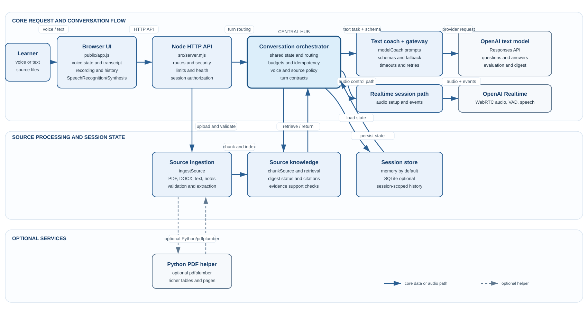
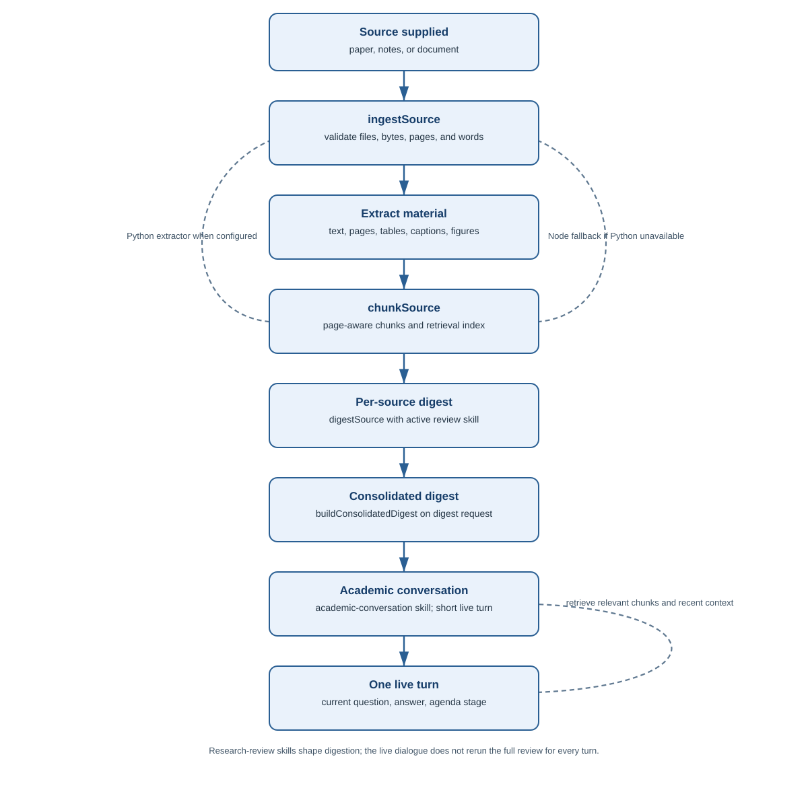
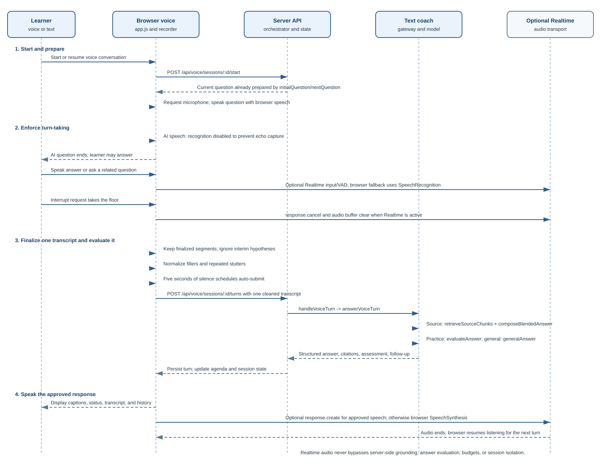

# deepchat2learn — academic learning system summary

<p align="center"></p>

## 1. Purpose

deepchat2learn is a browser-based academic learning environment built around voice and text conversation. Its central promise is **deep conversations for better learning**: the learner explains, asks, listens, challenges, and revises ideas while the AI provides structured help, meaningful questions, and evidence-aware explanations.

The system is not primarily a document summarizer or a speech-recognition demo. It is a learning scaffold for:

- building a coherent mental model of a topic;
- practicing clear academic explanation;
- exposing uncertainty and misconceptions;
- connecting evidence to methods, results, and implications;
- transferring understanding to new questions and applications.

The core learning loop is:

```text
orient -> explain -> question -> connect evidence -> refine -> apply or reflect
```

The product has two modes:

- **Practice speaking:** the system asks progressive questions, listens to the learner's explanation, assesses relevance and academic meaning, gives concise constructive guidance, and asks a response-linked follow-up.
- **Ask about materials:** the system digests uploaded or pasted sources, develops a paper-level knowledge model, answers questions in its own words, adds clearly identified general knowledge when useful, and facilitates a source-centered academic discussion.

Both modes use `academic-conversation` as the live dialogue skill. `academic-research` and `epi-research` are used for deeper source digestion and methods-oriented analysis, so the live conversation can stay focused, responsive, and educational.

## 2. Design philosophy and strategies

deepchat2learn treats conversation as the learning interface. The goal is not to maximize the amount of text or the number of facts delivered; it is to help the learner understand, articulate, question, and use knowledge. Its behavior follows these principles:

1. **Conversation is the primary learning activity.** The AI is a tutor, interlocutor, and facilitator—not just an answer generator. It responds to the learner's question before asking its own and uses the learner's answer to decide what comes next.
2. **Depth comes from progression, not verbosity.** Dialogue begins with simple orientation, then moves through design, population, measures, findings, interpretation, limitations, and application. Each turn adds one useful layer instead of repeating the paper or overwhelming the learner.
3. **Support and challenge are balanced.** The system explains difficult ideas in accessible language, checks understanding with focused questions, identifies meaningful gaps without shaming the learner, and offers a path to improve the answer.
4. **Learner agency is preserved.** The learner may answer, ask a question, interrupt, request a new issue, change direction, or use typed input. The AI facilitates the discussion rather than forcing a rigid question-and-answer script.
5. **Sources provide evidence; conversation provides understanding.** Digested materials and retrieved passages ground paper-specific claims. The AI paraphrases, interprets, compares, and explains why a point matters instead of reading passages aloud. General knowledge is clearly separated when the source is incomplete.
6. **Academic integrity is explicit.** The system distinguishes source-supported claims, digest-level understanding, general LLM knowledge, and unresolved uncertainty. It does not invent details or imply that a general explanation came from the paper.
7. **Voice should feel natural but remain teachable.** Turn-taking, interruption, visible status messages, cleaned final transcripts, concise responses, and typed fallback keep the interaction usable while protecting the quality of the learning exchange.
8. **Every turn has a purpose.** A response should explain, connect, clarify, test, compare, or advance the agenda. Repeated questions, circular follow-ups, and superficial restatements are treated as quality failures.
9. **Reliable boundaries protect learning.** Session histories, source materials, transcripts, and recordings remain isolated by session. Interim speech is never treated as a final answer, and failed requests remain retryable without corrupting the learner's progress.

The design therefore follows this teaching sequence:

```text
learner contribution
  -> direct explanation or response
  -> connection to evidence or concept
  -> one focused learning question
  -> next agenda stage or targeted clarification
```

### Learning-oriented performance strategy

- Keep live prompts compact and send the current question and latest answer as the primary context; the model prompt is bounded to three recent exchanges, while retrieval adds only the two most immediate exchanges for short follow-ups. This protects conversational rhythm and keeps attention on the learner's current reasoning.
- Preserve a bounded but diverse digest, including key points, evidence, conflicts, and open questions, rather than sending the full paper on every turn.
- Retrieve only the most relevant source chunks for the current question and use the digest to maintain paper-level continuity.
- Keep practice spoken responses concise; source-mode spoken responses normally use four to six sentences, with one meaningful explanation and at most one follow-up question.
- Use staged source digestion for large documents and retain a clearly marked fallback result when live answer synthesis is unavailable.
- If a generated source answer merely repeats the digest or a recent assistant answer, request one focused revision using a new paper-specific detail, implication, limitation, or comparison.
- Treat provider timeouts and malformed responses as recoverable states with retryable transcripts and local fallback behavior.

### Learning quality strategy

The package combines unit tests, API tests, source-ingestion tests, model-schema tests, browser-harness tests, voice-state tests, recording tests, and SQLite persistence tests. Regression tests protect the learning contract as well as the software: clean transcripts, direct answers, paraphrased source synthesis, progressive follow-ups, non-circular dialogue, visible status, interruption behavior, session isolation, and citation validation.

## 3. High-level architecture

<p align="center"></p>

### Main components

| Component | Responsibility |
|---|---|
| `public/index.html`, `public/styles.css` | Landing page, session layout, voice status display, responsive blue brand styling. |
| `public/app.js` | Browser state, API calls, voice UI, transcript handling, auto-submit, captions, history, recording controls. |
| `public/audioRecording.js` | Opt-in local `MediaRecorder` capture; audio is kept in the browser and can be downloaded. |
| `src/server.mjs` | HTTP API, static files, session routing, health reporting, source endpoints, voice endpoints, security headers. |
| `src/conversationOrchestrator.mjs` | Coordinates answer submission, source answers, new-question requests, budgets, idempotency, and turn state. |
| `src/modelCoach.mjs` | Strict structured text-model calls, prompt construction, schema normalization, safe fallbacks, digesting, source-grounded answers. |
| `src/modelGateway.mjs` | Routes named text tasks, applies per-task timeouts and transient retries, and preserves typed provider errors. |
| `src/realtime.mjs` | OpenAI Realtime/WebRTC audio transport when configured; browser speech remains the fallback transport. |
| `src/voiceSession.mjs` | Voice-turn lifecycle, source/practice result envelopes, session history, agenda propagation, retry behavior. |
| `src/sourceIngestion.mjs` | File validation and extraction for PDF, DOCX, TXT, Markdown, and pasted text. |
| `src/sourceKnowledge.mjs` | Chunking, retrieval, digest status, citations, source support status, and evidence lookup. |
| `src/store.mjs`, `src/sqliteStore.mjs` | Session-scoped in-memory storage or optional SQLite persistence. |
| `skills/` | Academic conversation, academic research, and epidemiology methods-review guidance. |

## 4. Model and skill design

The system deliberately separates responsive academic conversation from deeper document analysis. The separation lets the learner stay in a natural dialogue while the heavier research skills prepare reliable source knowledge in the background.

<p align="center"></p>

- `academic-conversation` is the main live conversation skill in both modes. It keeps responses concise, asks one question at a time, evaluates relevance without turning source discussion into a scorecard, and moves from orientation to deeper issues.
- `academic-research` supports broad source digestion and evidence organization.
- `epi-research` supports graduate-level epidemiology critique, including estimands, study design, selection, measurement, confounding, longitudinal methods, causal inference, modeling, sensitivity analysis, and future research priorities.
- Source material is treated as evidence, not as executable instructions. Model answers distinguish source claims from general LLM knowledge and external research.

### Source-answer context contract

Every source-mode answer is built from four bounded context layers, in this order:

1. **Paper-level digest:** a cross-source mental model of the research question, design, population, measures, findings, interpretation, limitations, and open questions.
2. **Retrieved evidence:** the most relevant source chunks for the current question, treated as the authoritative evidence layer. Exact short excerpts are retained for verification, while the answer itself is paraphrased and explained.
3. **Immediate dialogue context:** the current user question or answer plus a maximum of three recent source-mode exchanges in the model prompt. For a short follow-up, retrieval uses only the two most immediate exchanges so older history does not dilute the search query.
4. **Additional LLM context:** general academic knowledge used only when the supplied materials are incomplete. It is retained separately, labeled as additional context, and never presented as a claim from the paper.

The model must answer the learner's question directly, connect the explanation to a specific source idea when possible, explain why the point matters, and ask at most one related follow-up. Source-mode speech normally contains four to six sentences so it can explain rather than merely quote. It must not simply repeat the digest, copy a passage, invent paper-specific details, or silently turn a source discussion into a practice-coaching scorecard. If no supporting source citation is returned despite available source context, the result is marked as not directly supported by the supplied materials and the uncertainty is shown to the user.

## 5. Conversation agenda and progression

The shared agenda prevents repeated questions and circular dialogue:

```text
orientation
  -> design
  -> population
  -> measures
  -> findings
  -> interpretation
  -> limitations, implications, or application
```

`src/conversationAgenda.mjs` derives the current stage, next stage, turn count, and a bounded list of recent questions. The agenda is passed through both model and fallback paths. A sufficiently developed answer advances the discussion; a partial answer receives one targeted clarification before progression continues.

Each session has independent history, source material, question limits, digest state, model budget, voice state, and recording state. Practice sessions default to 50 rounds; source sessions default to 200 rounds.

## 6. Voice conversation flow

<p align="center"></p>

The browser owns turn-taking. With browser voice, `SpeechRecognition` captures the learner and `SpeechSynthesis` speaks the approved response. With Realtime enabled, the browser establishes WebRTC through `/api/realtime/call`; Realtime supplies audio transport, server VAD, and transcription events, while the backend text path remains authoritative for source grounding, answer evaluation, budgets, and session state.

### Voice safeguards

- Microphone input is disabled while the AI is speaking, unless the learner explicitly interrupts the answer.
- The interrupt action stops AI playback, invalidates any stale client response, clears the active answer/question draft and recognition buffer, and opens a fresh learner-listening turn.
- The interrupted server turn is marked `interrupted`; it is excluded from source retrieval context so the next question cannot inherit the unfinished AI answer, while a turn that already had a learner answer remains counted for session accounting.
- Interim speech-recognition hypotheses never enter the answer box or the server request.
- Final hypotheses are de-duplicated by recognition index; revised final wording replaces earlier wording.
- Multiple finalized speech segments are accumulated before submission.
- The final voice transcript is normalized before display and model submission: fillers such as “um” and “uh” are removed, obvious repeated words or phrases are collapsed, and punctuation is tidied without changing typed-answer behavior.
- Five seconds of silence submits the answer automatically; typed answers retain manual submission.
- Failed turns keep the transcript retryable and do not silently consume the next round.
- Late responses from a stopped or superseded turn cannot overwrite the active session state.
- Browser voice remains available when Realtime is unavailable; typed controls remain available when microphone permission is denied.

### Voice conversation controls

The live turn classifier applies a fixed precedence so learner requests are not mistaken for answers:

1. Closing phrases such as “I’m done” or “let’s close the conversation” stop turn-taking, speak a short closing acknowledgment, complete the session, and open the existing summary with transcript and local-audio download options.
2. Move-on phrases such as “let’s change to another topic,” “let’s move on,” or “check another point” select a new unvisited academic or source-grounded question without consuming an answer round.
3. Direct and explanatory questions such as “what is,” “why,” “how do I,” “explain,” or “provide an example” receive a direct answer. Source mode uses retrieved material first and adds general academic LLM knowledge when the source does not contain enough detail.
4. Other speech follows the normal practice-evaluation or source-discussion path.

The finalized transcript is placed in the answer box before the request is sent and remains visible while the model is processing. Interim recognition text is never displayed as a final answer or transmitted. The draft is cleared only when the next listening state begins, or when the session is reset or completed.

## 7. Source-processing flow

1. The browser uploads a PDF, DOCX, TXT, Markdown file, or pasted notes.
2. The server validates file count, bytes, pages, and word limits.
3. PDF extraction attempts the configured Python executable with `pdfplumber` when available. The Node fallback remains available for ordinary web-host deployments.
4. Extraction retains page-aware text, table rows, captions, embedded-figure metadata, and safely extractable figure bytes where available. Scanned-PDF OCR and visual figure interpretation are not included by default.
5. Text is chunked and indexed for retrieval.
6. Each upload first receives a per-source `digestSource` result. An explicit digest request then runs `rebuildSessionDigest`, which calls `buildConsolidatedDigest` across the session's sources and chunks. The digest model creates a paraphrased, evidence-linked paper model, with coverage across research question, design, population, measures, findings, interpretation, and limitations when supported. Exact excerpts are retained for verification rather than used as the main explanatory prose.
7. If model digestion fails, an extractive digest remains available and the UI reports the processing limitation separately from ordinary conversation errors.
8. During conversation, retrieval supplies relevant chunks and digest points. The LLM must answer a learner’s question directly, explain the meaning or importance of the evidence in its own words, and then ask one related question. It may add general academic knowledge when permitted, but must label or distinguish claims not supported by the supplied source.

### Source-answer quality controls

During conversation, the system combines the normalized paper digest, relevant retrieved chunks, the current question or answer, and only the most immediate prior exchanges when needed to resolve a short follow-up. The LLM must answer directly, synthesize in its own words, explain why the evidence matters, and then ask one related question. General academic knowledge may be added when permitted, but it remains a separate labeled layer and is never presented as a claim from the paper.

Response normalization validates the structured answer envelope, source-support status, and exact citations. Paraphrased digest points are accepted only when they carry separate exact evidence. Uncited prose is not silently treated as source-grounded: it is marked as additional or unsupported context, depending on the available evidence. If live synthesis fails, the response is marked as a model fallback and does not present a raw source sentence as if it were an interpreted answer.

## 8. API and state logic

The server exposes routes for session creation, source upload/deletion, digest status, typed questions, voice turns, close/move-on controls, interruption/retry controls, summaries, health, and optional Realtime initialization.

The normal typed/voice answer path is:

```text
validate session and budget
  -> reject duplicate idempotency key or replay stored result
  -> classify close, move-on, direct question, or ordinary answer
  -> complete or advance non-answer controls without consuming a round
  -> preserve current question and session-specific history
  -> retrieve source evidence when in source mode
  -> call academic conversation or safe local fallback
  -> validate structured response and citations
  -> persist turn and advance agenda
  -> return concise answer plus next question
```

Strict response schemas protect the provider boundary. Invalid provider responses, timeouts, or unavailable keys produce bounded local fallbacks rather than corrupting session state. Source answers report whether they are source-supported, digest-only, general-knowledge, unsupported, or fallback-derived.

### Verified call chains

| Operation | Actual call sequence | Result |
|---|---|---|
| Start a session | `server.mjs` -> `createConversationOrchestrator.startSession` -> `coach.initialQuestion` -> store | Creates an isolated session and initial question. |
| Upload a source | `server.mjs` -> `ingestSource` -> `chunkSource` -> `digestSource` -> `modelGateway.runTextTask('source_digest')` | Stores extracted text, artifacts, chunks, and a per-source digest. |
| Build the full digest | `rebuildSessionDigest` -> `buildConsolidatedDigest` -> `modelGateway.runTextTask('source_digest')` | Stores the cross-source digest or an extractive fallback. |
| Submit a voice turn | Browser `submitTranscript` -> `POST /api/voice/sessions/:id/turns` -> `handleVoiceTurn` -> `answerVoiceTurn` | Retrieves source evidence when needed, validates the response, persists the turn, and returns the next question. |
| Practice answer | `detectVoiceIntent` -> `buildCoachingResult` -> `coach.evaluateAnswer` -> `modelGateway.runTextTask('practice_evaluation')` | Returns academic assessment, concise coaching, and a related question. |
| Source discussion | `detectVoiceIntent` -> `buildSourceAnswerResult` -> `retrieveSourceChunks` -> `coach.composeBlendedAnswer` -> `modelGateway.runTextTask('source_answer')` | Returns a source-grounded, paraphrased answer with citations and follow-up. |
| Realtime audio setup | Browser WebRTC offer -> `POST /api/realtime/call` -> `modelGateway.createRealtimeCall` -> `createRealtimeCall` | Establishes the configured live-audio transport; it does not bypass backend text evaluation. |

### Request limits and timeouts

The current test package defaults are 120 seconds for ordinary text tasks, 300 seconds for source digestion, and 120 seconds for Realtime initialization/call setup. These are server-side request deadlines; provider quotas, context windows, rate limits, and hosting-proxy limits may still impose shorter limits. Source uploads are limited to 10 files, 20 MB per file, 50 MB combined, 300 pages, and 150,000 extracted words. Practice and source sessions default to 50 and 200 rounds respectively.

## 9. Privacy and deployment model

- The OpenAI key is server-side only and belongs in a local `.env` created from `.env.example`.
- Local audio recording is opt-in, browser-local, never uploaded, and never persisted in the session record.
- Session retention defaults to in-memory session scope; SQLite persistence is optional.
- Source material and transcripts are session-scoped and can be deleted with the session.
- The package runs on a typical Node web host without Python. Python is an optional enhancement for richer PDF extraction.
- The browser requires HTTPS or localhost for reliable microphone access and WebRTC behavior in production.

### Deployment prerequisites

The distributable `.env.example` deliberately leaves `DEEPCHAT2LEARN_PYTHON_BIN` blank. Python is optional: ordinary text-based PDFs, DOCX/Word files, TXT, Markdown, and pasted notes can use the built-in Node extraction path on a typical Node web host. For complex research PDFs with difficult layouts, tables, figures, or scanned pages, configure the host's own `python.exe` and install optional packages such as `pdfplumber` and/or `PyMuPDF`; OCR or figure-vision tools may be needed separately. Never distribute a developer's absolute Python path.

Without an API key, local fallback coaching, typed interaction, browser speech, and source extraction remain available. Provider-backed, real-time, and more comprehensive answers require the deployer's own API key. The current package is tested against the OpenAI API contract; keys from Claude, Gemini, Grok, DeepSeek, Kimi, or another provider require an adapter or OpenAI-compatible endpoint. Real-time GPT Live-style voice additionally requires a compatible Realtime/WebRTC service.

## 10. Possible uses

- Graduate students discussing epidemiology papers before journal club.
- Voice practice for explaining a research question, design, results, or limitations.
- Source-grounded study sessions for papers, lecture notes, protocols, and reports.
- Research-methods tutoring with questions that progress from basic orientation to causal and analytical detail.
- Interview or presentation practice with relevance feedback and concise spoken coaching.
- Instructor demonstrations of source digestion, evidence traceability, and academic dialogue.
- Self-study of unfamiliar statistical or epidemiological concepts through question-led explanation.

## 11. Current limitations

- The live text path depends on provider availability, valid model configuration, and network latency.
- Realtime audio is a configured transport option in the core voice design; browser speech fallback keeps the conversation usable when the provider, browser, or network cannot support WebRTC.
- PDF extraction is strongest for digitally generated research papers. OCR and visual interpretation of complex figures require future work.
- The digest is evidence-linked but is not a substitute for a full human critical appraisal.
- There is no user authentication, multi-tenant authorization layer, or production-grade distributed session store in this MVP.
- External research is consent-gated and should be configured and audited before deployment to students.

## 12. Recommended future improvements

### Highest priority: conversation reliability

1. Add browser-level end-to-end tests with real permission prompts, interruptions, long pauses, and slow network simulation.
2. Add provider retry/backoff with request correlation IDs and user-visible recovery actions.
3. Add streaming text responses or early sentence playback to reduce perceived latency.
4. Keep a small server-side conversation state machine rather than rebuilding context in multiple modules.

### Source comprehension

5. Add optional OCR for scanned PDFs and a figure/table interpretation pipeline with explicit uncertainty labels.
6. Show citations, page references, digest coverage, and source-versus-general-knowledge labels directly in the conversation UI.

### Product and safety

7. Add authentication, per-user quotas, encrypted storage, and configurable deletion policies before public hosting.
8. Add skill versioning and a settings view showing which conversation and source-digestion skills are active.

### Learning quality

9. Add end-of-session concept maps, misconception summaries, and spaced follow-up questions.
10. Add instructor-defined rubrics and paper-specific learning objectives without making every live turn run the full research-review workflow.

## 13. Current audit status

The package was independently checked for conversation-first behavior, session isolation, skill routing, voice turn-taking, transcript finalization, source grounding, provider error handling, and setup consistency.

- Live dialogue uses `academic-conversation` in both modes. `academic-research` and `epi-research` are limited to source digestion and methods-oriented preparation.
- Browser speech and configured Realtime audio share the same turn coordinator. AI audio disables microphone capture until playback ends; explicit interruption opens learner listening. Only finalized, cleaned transcripts are submitted.
- Source answers combine a bounded paper-level digest, relevant retrieved evidence, the current learner turn, and at most three recent exchanges. The response must answer directly, paraphrase, label general knowledge, and advance the agenda. Retrieval now avoids reusing recently cited chunks when relevant alternatives exist, and semantic overlap checks request a new synthesis when a draft paraphrases a prior answer.
- A changed transcript cannot replay a prior idempotency key. Safe response diagnostics record model status, fallback reason, agenda stage, retrieval counts/IDs, duration, and a short content hash without logging raw transcript, prompt, source text, or API keys.
- Ordinary text tasks use the 120-second provider timeout; source digestion uses the configured 300-second timeout end to end, including the underlying model-coach request; Realtime initialization uses 120 seconds by default.
- The current verification run passed syntax checks and 462 tests: 459 passed, 0 failed, and 3 optional Python-dependent PDF tests were skipped because the optional extractor was not available in the deterministic test environment.

### Mobile Realtime voice hardening

- WebRTC offers now wait for ICE gathering and send the completed local SDP, which is important on mobile networks that do not provide usable candidates immediately.
- The remote audio element is created during the user gesture, marked `autoplay` and `playsInline`, kept available for Safari playback, and explicitly started when the remote track arrives.
- If Realtime negotiation fails, the client clears the failed transport and starts the browser voice fallback when supported instead of leaving the conversation in a broken Realtime state.
- Realtime call failures update `/api/health` with safe status and provider diagnostics for hosted deployment troubleshooting.
- Browser voice now primes speech recognition directly from the start-button gesture, clearly asks users to allow microphone and browser speech recognition, recovers from speech playback errors, and uses a conservative mobile playback watchdog if Safari fails to send a completion event.
- The landing page includes an explicit **Enable voice access** preflight so users can grant browser permissions before creating a session.
- The clean distribution copy contains only `.env.example`. A private local `.env` may be created for provider-backed testing, but never include the key, source papers, transcripts, SQLite files, or recordings in a distribution archive.

The remaining material risks are provider latency, browser permission and WebRTC variability, scanned-PDF/OCR limitations, and the absence of production authentication and multi-user isolation. These are deployment constraints rather than failures of the current local conversation flow.

## 14. Milestone record — 2026-07-19

This is the canonical milestone and handoff record. It replaces the former standalone milestone summary so future work has one status source.

### Handoff anchor

- **Stage:** functional MVP / controlled demonstration.
- **Primary goal:** smooth, academically meaningful voice conversation supported by supplied source materials.
- **Marker:** active baseline; resume from this clean package and this document.
- **Live demonstration:** [deepchat2learn.onrender.com](https://deepchat2learn.onrender.com/).

### Verification snapshot

- `npm run verify`: passed after the current audit.
- Syntax checks: passed for all required JavaScript modules.
- Deterministic tests: 462 total; 459 passed; 0 failed; 3 optional Python-dependent PDF tests skipped when the optional extractor is unavailable.
- Package contents: 88 files; no private `.env`, API key, SQLite data, recordings, temporary files, dependencies, or raw source papers are distributed.
- Voice and source behavior is verified by deterministic browser/API harnesses; provider-backed Realtime audio, browser permissions, Python PDF extraction, and hosted deployment remain environment-dependent.

### Independent audit result

- Fixed the client session-reset lifecycle so a pending browser speech-permission probe is explicitly cancelled on **New session** or **Delete data**, while ordinary recognition shutdown still completes a successful probe normally.
- Added a regression test for reset-state completeness and pending-probe cancellation.
- Removed the developer-specific path from the optional research-PDF integration test; set `DEEPCHAT2LEARN_RESEARCH_PDF` locally when that test should run against a supplied paper.
- Rebuilt and scanned the distribution archive after the audit. The package contains no real secret patterns, machine-specific paths, private runtime data, or disallowed archive entries.

### Feature-status checklist

| Area | Verified in the package | Implemented but environment-dependent | Planned or MVP-limited |
|---|---|---|---|
| Server and sessions | Node server, security headers, health, capability tokens, 50/200 mode limits, budgets, rate limits, retention, expiry, deletion, idempotency, stale-turn protection | Provider-backed requests and hosted concurrency | Authentication, distributed multi-user isolation, production observability |
| Conversation and learning | Progressive agenda, direct questions, relevance evaluation, concise feedback, response-linked follow-ups, move-on/close handling, fallback coach, skill routing | Provider answer quality and broader academic coverage | Learning analytics, concept maps, spaced review, instructor rubrics |
| Voice and recording | Turn coordinator, silence submission, multi-segment accumulation, final-only transcripts, cleanup, AI-mic suppression, interruption, status messages, retryable turns, local recording lifecycle | Browser permissions, speech APIs, Realtime WebRTC, complete remote-audio recording, device/network behavior | Broader cross-browser E2E coverage and streaming playback |
| Source processing | TXT/Markdown/DOCX/text-PDF extraction, metadata, tables/captions where extractable, chunking, retrieval, per-source and cross-source digest, fallback, citations, conflicts, deletion, limits | Python `pdfplumber`/PyMuPDF enhancement, external research provider | OCR and default visual figure interpretation |
| Skills | `academic-conversation` for live turns; `academic-research` and `epi-research` for source digestion/review; explicit and automatic selection | Human review still needed for academic accuracy and pedagogy | Skill versioning and comparative evaluation |
| UI and privacy | Voice preflight, processing/status announcements, session/mode-specific history, draft clearing, review/export, source panel, accessible controls, brand identity, local-only recording boundary | HTTPS, device permission behavior, hosted privacy configuration | Authentication, encrypted durable storage, user quotas |

### Core handoff logic

```text
read this system summary
  -> verify provider and deployment configuration
  -> run hosted browser smoke test for voice and source discussion
  -> record latency, permissions, interruptions, and fallback outcomes
  -> fix one highest-impact failure
  -> add a regression test
  -> update this section and rebuild the clean package
```

The project remains conversation-first: preserve turn-taking, session boundaries, source grounding, concise responses, visible recovery, and academically meaningful progression before adding new agents or deeper analysis features.

### Milestone risks to monitor

1. **Voice transport:** browser permissions, echo cancellation, device differences, provider latency, and WebRTC behavior can differ from the deterministic harness.
2. **Source comprehension:** extraction and retrieval errors can produce shallow or repetitive answers even when conversation mechanics are correct.
3. **Context leakage:** stale drafts, interrupted turns, or mixed mode history can silently reduce answer quality if session boundaries regress.
4. **Provider dependency:** timeouts, quotas, model changes, cold starts, and incompatible API keys can affect hosted behavior.
5. **Production safety:** authentication, multi-user isolation, privacy controls, and operational monitoring are not production-complete.
